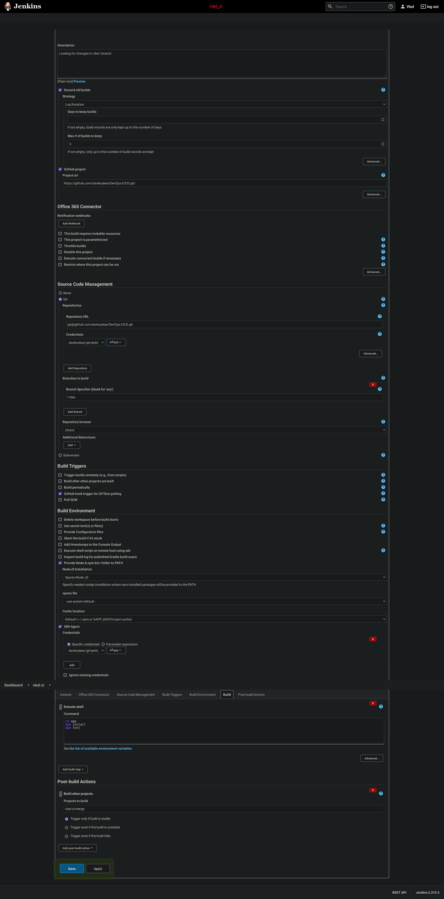
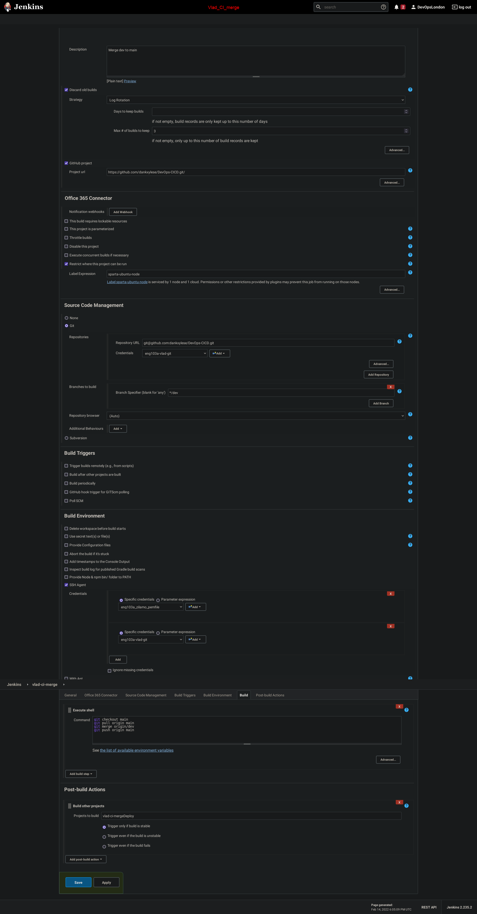
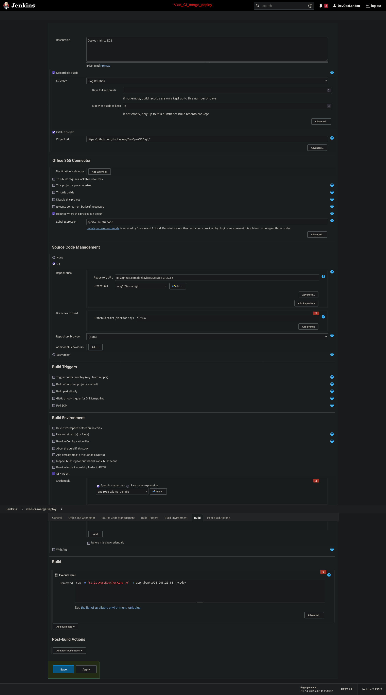

# Let's build a Continuous Integration and Continuous Delivery/Deployment (CICD) Pipeline
## Jenkins
### Webhooks with Github
#### Automated Testing using Jenkins
#### Automated Deployment on AWS EC2 for 2Tier architecture - Nodejs app and Mongodb  

- Jenkins Work flow
  


#### Continuous Integration Continuous Delivery/Deployment 


#### Let's break it down 


### For deployment job in Jenkins
- In the execute shell of CD job

```
# we need to by pass the key asking stage with below command:
ssh -A -o "StrictHostKeyChecking=no" ubuntu@ec2-ip << EOF	
# copy the the code
# run your provision.sh to install node with required dependencies for app instance - same goes for db instance (ensure to double check if node and db are actively running)

# create an env to connect to db
# navigate to app folder
# kill any existing pm2 process just in case
# launch the app
nohup node app.js > /dev/null 2>&1 & - use this command to run node app in the background

# To debug ssh into your ec2 and run the above commands
```
## Jenkins CI 

- Don't forget to generate a `Deploy key` for Jenkins to have access to your git, and add a webhook that points towards your Jenkins url in such a fashion `http://0.0.0.0:8080/github-webhook/`

#### Build 1 (Continuous Integration)

- This Build #1 (CI) job is to grab the files from our `/dev/` branch on github, build it and see if there are any errors. If there are no errors, and the build is successful, then continue to Build #2 (CI_Deploy)



#### Build 2 (Continuous Deployment)

- This Build #2 (CI_Merge) job is to now that files have been tested with job #1, job #2 can merge changes in the `/dev/` branch to `/main/`. If this is too, successful, then Build 3 is triggered.



#### Build 3 (Continuous Delivery)

- This Build #3 (CI_Merge_Deploy) job is to finally push the files to an EC2 instance on AWS. It will begin by grabbing files from the `/main/` branch and then copying them with the `scp` command.



Test1